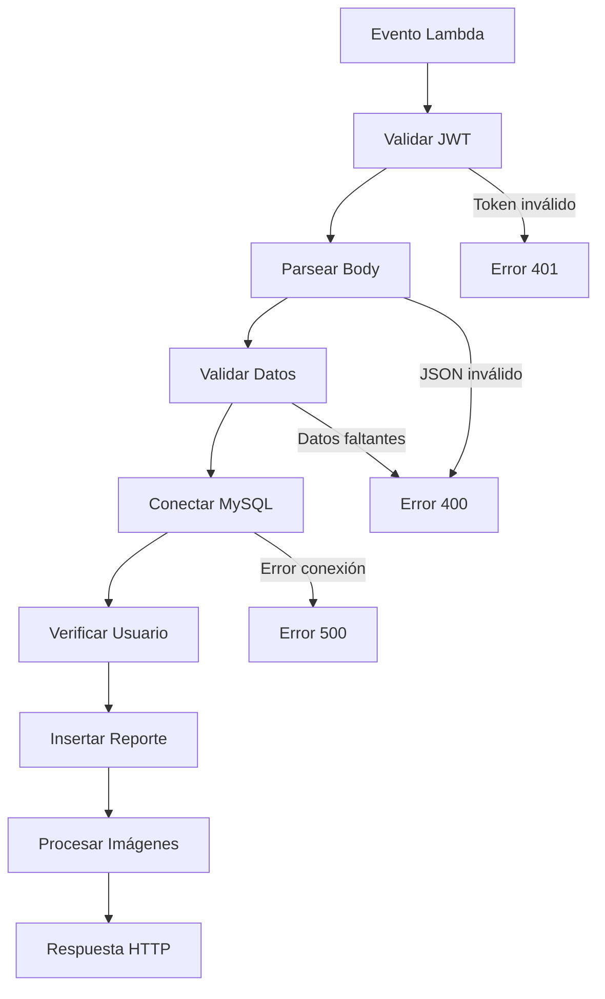

# ⚡ Función Lambda - API de Reportes

Función Lambda en Node.js 18.x que proporciona una API para crear reportes de servicio técnico con autenticación JWT y conexión a MySQL.

## 🎯 Descripción

Esta función Lambda:
- ✅ **Autentica** usuarios con tokens JWT
- ✅ **Valida** datos de entrada
- ✅ **Se conecta** a base de datos MySQL RDS
- ✅ **Crea** reportes de servicio
- ✅ **Procesa** imágenes (simulado para AWS Academy)
- ✅ **Retorna** respuestas HTTP estructuradas

## 🚀 Despliegue Rápido

```bash
# 1. Ir al directorio
cd order-service-queues

# 2. Construir paquete con dependencias
mkdir lambda-build
cp create-service.js package.json lambda-build/
cd lambda-build && npm install
zip -r ../lambda-create-reporte-with-deps.zip .
cd ..

# 3. Desplegar con Terraform
terraform init
terraform apply --auto-approve
```

## 📦 Dependencias

### package.json
```json
{
  "name": "lambda-create-reporte",
  "version": "1.0.0",
  "dependencies": {
    "mysql2": "^3.6.0",      // Cliente MySQL con soporte async/await
    "jsonwebtoken": "^9.0.2"  // Validación de tokens JWT
  }
}
```

### Variables de entorno (configuradas automáticamente)
```bash
DB_HOST=jardila-reportes2.cuhps5uu7rzq.us-east-1.rds.amazonaws.com
DB_USER=jardila_reportes
DB_PASSWORD=Zsw2Xaq1
DB_NAME=jardila_reportes2
JWT_SECRET=mi_clave_secreta_super_segura_123
```

## 🏗️ Arquitectura

### Función handler
```javascript
exports.handler = async (event) => {
  // 1. Headers CORS
  // 2. Validación JWT
  // 3. Parsing de datos
  // 4. Validación de campos
  // 5. Conexión a BD
  // 6. Verificación de usuario
  // 7. Inserción de reporte
  // 8. Procesamiento de imágenes
  // 9. Respuesta HTTP
}
```

### Flujo de procesamiento


## 📡 API Specification

### Request Format
```http
POST /reportes HTTP/1.1
Content-Type: application/json
Authorization: Bearer <JWT_TOKEN>

{
  "numero_reporte": "RPT-2025-004",
  "empresa": "Mi Empresa S.A.S",
  "contacto": "Juan Pérez",
  "telefono": "123-456-7890",
  "email": "contacto@empresa.com", 
  "ciudad": "Bogotá",
  "servicio_reportado": "Mantenimiento preventivo",
  "tipo_servicio": "Mantenimiento",
  "informe": "Descripción del trabajo realizado",
  "observaciones": "Observaciones adicionales",
  "nombre_tecnico": "Carlos Técnico",
  "cedula_tecnico": "12345678"
}
```

### Response Format

#### ✅ Éxito (201 Created)
```json
{
  "statusCode": 201,
  "headers": {
    "Content-Type": "application/json",
    "Access-Control-Allow-Origin": "*",
    "Access-Control-Allow-Headers": "Content-Type,Authorization",
    "Access-Control-Allow-Methods": "OPTIONS,POST"
  },
  "body": {
    "message": "Reporte creado exitosamente",
    "reporte": {
      "id": 5,
      "numero_reporte": "RPT-2025-004",
      "usuario": "admin",
      "fecha": "2025-07-19T02:43:20.000Z",
      "empresa": "Mi Empresa S.A.S",
      // ... más campos
    },
    "reporteId": 5
  }
}
```

#### ❌ Error de autenticación (401)
```json
{
  "statusCode": 401,
  "body": {
    "error": "Token de autorización requerido",
    "code": "NO_TOKEN"
  }
}
```

#### ❌ Error de validación (400)
```json
{
  "statusCode": 400,
  "body": {
    "error": "El campo 'numero_reporte' es requerido",
    "code": "VALIDATION_ERROR"
  }
}
```

#### ❌ Número de reporte duplicado (409)
```json
{
  "statusCode": 409,
  "body": {
    "error": "El número de reporte ya existe",
    "code": "DUPLICATE_REPORTE_NUMBER"
  }
}
```

## 🧪 Testing

### 1. Generar token JWT válido
```bash
# Crear generador de token
cat > generate-token.js << 'EOF'
const jwt = require('jsonwebtoken');

const payload = {
    id_usuario: 1,
    usuario: "admin",
    nombre: "Administrador",
    rol: "admin",
    iat: Math.floor(Date.now() / 1000),
    exp: Math.floor(Date.now() / 1000) + (60 * 60) // 1 hora
};

const secret = "mi_clave_secreta_super_segura_123";
const token = jwt.sign(payload, secret);
console.log(token);
EOF

# Ejecutar (requiere dependencias instaladas)
node generate-token.js
```

### 2. Crear evento de prueba
```bash
cat > test-event.json << 'EOF'
{
  "httpMethod": "POST",
  "headers": {
    "Content-Type": "application/json",
    "Authorization": "Bearer [REEMPLAZAR_CON_TOKEN]"
  },
  "body": "{\"numero_reporte\":\"TEST-$(date +%s)\",\"empresa\":\"Empresa Test\",\"contacto\":\"Juan Pérez\",\"telefono\":\"123-456-7890\",\"email\":\"test@empresa.com\",\"ciudad\":\"Bogotá\",\"servicio_reportado\":\"Mantenimiento de equipos\",\"tipo_servicio\":\"Preventivo\",\"informe\":\"Prueba de función Lambda\",\"observaciones\":\"Todo en orden\",\"nombre_tecnico\":\"Carlos Técnico\",\"cedula_tecnico\":\"12345678\"}"
}
EOF
```

### 3. Invocar función Lambda
```bash
# Prueba directa
aws lambda invoke \
  --function-name create-reporte \
  --payload "$(cat test-event.json | base64)" \
  --cli-binary-format base64 \
  response.json

# Ver respuesta
cat response.json
```

### 4. Verificar en base de datos
```bash
mysql -h jardila-reportes2.cuhps5uu7rzq.us-east-1.rds.amazonaws.com \
      -u jardila_reportes \
      -p'Zsw2Xaq1' \
      jardila_reportes2 \
      -e "SELECT * FROM reportes ORDER BY id DESC LIMIT 1;"
```

## 📊 Validaciones Implementadas

### Campos requeridos
- ✅ `numero_reporte` (único, máx 50 caracteres)

### Validaciones de formato
```javascript
// Fechas (YYYY-MM-DD HH:MM:SS o YYYY-MM-DD)
fecha: /^\d{4}-\d{2}-\d{2}( \d{2}:\d{2}:\d{2})?$/

// Fechas inicio/cierre (YYYY-MM-DD)
fecha_inicio|fecha_cierre: /^\d{4}-\d{2}-\d{2}$/

// Horas (HH:MM:SS)
hora_inicio|hora_cierre: /^\d{2}:\d{2}:\d{2}$/
```

### Límites de longitud
```javascript
numero_reporte: 50 caracteres
empresa: 100 caracteres
nombre_tecnico: 100 caracteres
usuario: 50 caracteres
```

## 🔐 Seguridad

### Autenticación JWT
```javascript
// Validación de token
const authHeader = event.headers.Authorization;
const token = authHeader.substring(7); // Quitar "Bearer "
const decodedToken = jwt.verify(token, JWT_SECRET);
```

### Estructura del token
```json
{
  "id_usuario": 1,
  "usuario": "admin",
  "nombre": "Administrador",
  "rol": "admin",
  "iat": 1752892845,
  "exp": 1752896445
}
```

### Headers CORS
```javascript
const headers = {
  'Content-Type': 'application/json',
  'Access-Control-Allow-Origin': '*',
  'Access-Control-Allow-Headers': 'Content-Type,Authorization',
  'Access-Control-Allow-Methods': 'OPTIONS,POST'
};
```

## 📝 Logs y Debugging

### Ver logs en CloudWatch
```bash
# Obtener logs recientes
aws logs get-log-events \
  --log-group-name "/aws/lambda/create-reporte" \
  --log-stream-name $(aws logs describe-log-streams \
    --log-group-name "/aws/lambda/create-reporte" \
    --order-by LastEventTime --descending --limit 1 \
    --query 'logStreams[0].logStreamName' --output text) \
  --limit 10
```

### Tipos de logs
```javascript
console.log('Event:', JSON.stringify(event, null, 2));        // Request
console.error('Error:', error);                               // Errores
console.log('Simulando upload de imagen:', fileName);         // Debug
```

## 🔧 Configuración Terraform

### Recursos creados
```hcl
resource "aws_lambda_function" "create_reporte" {
  filename      = "lambda-create-reporte-with-deps.zip"
  function_name = "create-reporte"
  role         = "arn:aws:iam::${account_id}:role/lambda-run-role"
  handler      = "create-service.handler"
  runtime      = "nodejs18.x"
  timeout      = 30
  memory_size  = 256
  
  environment {
    variables = {
      DB_HOST     = var.db_host
      DB_USER     = var.db_user
      DB_PASSWORD = var.db_password
      DB_NAME     = var.db_name
      JWT_SECRET  = var.jwt_secret
    }
  }
}
```

### Outputs disponibles
```bash
terraform output lambda_function_arn    # ARN de la función
terraform output lambda_function_name   # Nombre: create-reporte
terraform output lambda_invoke_arn      # ARN para API Gateway
```

## 🛠️ Mantenimiento

### Actualizar código
```bash
# 1. Modificar create-service.js
# 2. Reconstruir paquete
cd lambda-build
zip -r ../lambda-create-reporte-with-deps.zip .
cd ..

# 3. Redesplegar
terraform apply --auto-approve
```

### Agregar dependencias
```bash
# 1. Modificar package.json
# 2. Reinstalar
cd lambda-build
npm install

# 3. Reconstruir y redesplegar
zip -r ../lambda-create-reporte-with-deps.zip .
cd ..
terraform apply --auto-approve
```

### Cambiar configuración
```bash
# Modificar variables.tf
# Aplicar cambios
terraform apply --auto-approve
```

## ⚠️ Limitaciones AWS Academy

### Recursos no disponibles
- ❌ **API Gateway**: No se pueden crear APIs HTTP
- ❌ **S3 Buckets**: Upload de imágenes simulado
- ❌ **IAM Roles**: Se usa `lambda-run-role` preexistente

### Workarounds implementados
- ✅ **Invocación directa** de Lambda para pruebas
- ✅ **Simulación de S3** en función de imágenes
- ✅ **Logs detallados** para debugging

## 📈 Performance

### Métricas típicas
- **Cold start**: ~500ms
- **Warm execution**: ~50-100ms
- **Memory usage**: ~80MB
- **Timeout**: 30 segundos

### Optimizaciones
- ✅ Reutilización de conexiones MySQL
- ✅ Validación temprana de datos
- ✅ Manejo eficiente de errores
- ✅ Logs estructurados

## 🧹 Limpieza

```bash
# Destruir función Lambda
terraform destroy --auto-approve

# Limpiar archivos temporales
rm -rf lambda-build/
rm lambda-create-reporte-with-deps.zip
```

---

**Tiempo de despliegue**: 2-3 minutos  
**Costo**: ~$0.20 USD/millón de invocaciones
